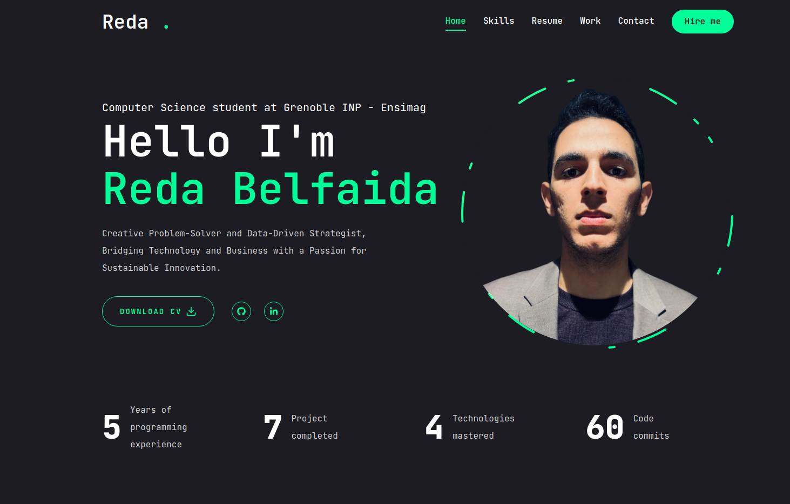
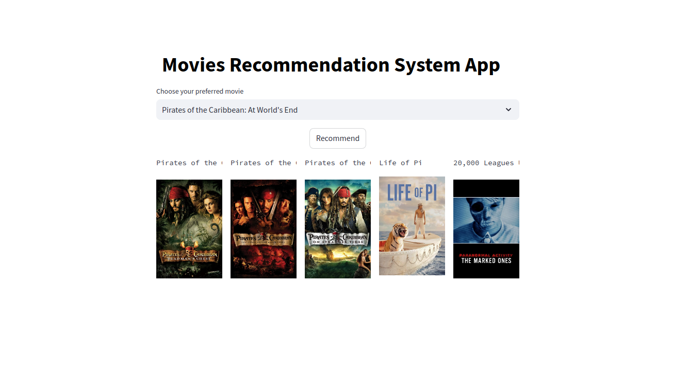

Hello, my name is Mohammed Reda, and I am currently studying at Grenoble INP - Ensimag, a prestigious French institution specializing in computer science and applied mathematics. I am passionate about data science and engineering, with a strong focus on machine learning (ML) models and data visualization.

My goal is to become a skilled data scientist or data engineer, applying my expertise to solve complex problems and drive data-driven decision-making. At Grenoble INP - Ensimag, I am actively developing my skills through hands-on projects and coursework, keeping abreast of the latest advancements in the field.

### Tech Stack

-  
- 
- 
- 
- 
- 
- 
- 
- 
- 

## Projects

### Last Completed Project

**Project Title** : [Digital Portfolio](https://github.com/BelfaidaMedReda/MyPortofilo) 

**Description** : Design of my personal portfolio

**Preview** :

  

### Current Project

**Project Title** : [Movie Recommender System](https://github.com/BelfaidaMedReda/Movie-Recommender)  

**Description** : A content-based movie recommendation system that suggests similar movies based on movie descriptions, genres, cast, crew, and keywords.

**Preview** :  

  

### GitHub Stats

  
  

### Contact

- 
- 
